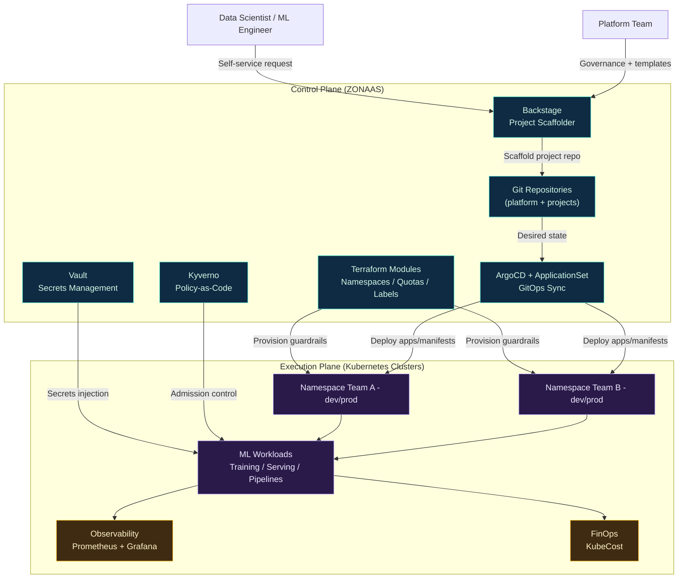

# Architecture ZONAAS

> Nomenclature officielle : **ZONAAS** (nom court), **ML Landing Zone as a Service** (nom original), alias **MLLZONAAS**.

## 1) Vue d’ensemble

ZONAAS implémente une architecture en **2 plans** :

- **Control Plane** : gouvernance, self-service, GitOps, sécurité transverse
- **Execution Plane** : exécution des workloads ML par projet/équipe/environnement

Objectif : délivrer des environnements ML standardisés, sécurisés et pilotés par Git.

## 2) Schéma d’architecture (pro, clair)

## 3) Flux opérationnel principal

1. Le Data Scientist demande un nouveau projet via **Backstage**.
2. Le Scaffolder génère le repo projet (template ML + conventions GitOps).
3. **Terraform** provisionne namespace(s), quotas, labels, policies de base.
4. **ArgoCD/ApplicationSet** synchronise automatiquement les workloads.
5. **Vault + Kyverno + NetworkPolicies** appliquent la posture sécurité.
6. **Prometheus/Grafana/KubeCost** donnent visibilité opérationnelle et coûts.

## 4) Séparation des plans

### Control Plane

- Repo plateforme, templates, modules IaC
- Politiques globales (sécurité / conformité)
- Orchestration GitOps multi-projets

### Execution Plane

- Namespaces projets (`<team>-<env>`)
- Workloads ML (train/serve/pipeline)
- Isolation réseau/ressources par tenant

## 5) Principes cloud-agnostic

- Manifests Kubernetes standards pour la couche core
- Variantes cloud encapsulées via overlays et modules Terraform
- Pas de dépendance forte à un provider unique dans le cœur plateforme

## 6) Frontière de responsabilité

- **Platform Team** : standards, sécurité, templates, gouvernance, SLO
- **Équipes ML** : code métier, modèles, pipelines, métriques applicatives

## 7) Extensions recommandées

- SSO/RBAC centralisé (OIDC)
- Policy bundles conformité par niveau (standard/strict)
- Environnements éphémères preview pour projets ML
