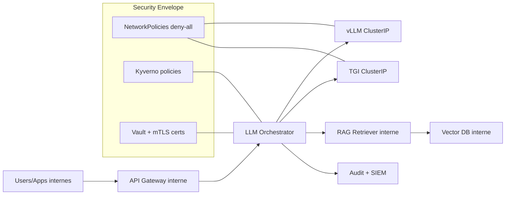

# ZONAAS Sovereign LLM Architecture

## Principes directeurs
- **Data residency**: données inférence et embeddings hébergées en interne
- **No-public-egress**: egress interdit par défaut pour workloads LLM
- **Least privilege**: identité, réseau et secrets minimaux
- **Auditability**: toute requête LLM doit être traçable

## Schéma

## Flux sécurisé
1. L’application interne appelle une gateway privée.
2. La gateway injecte identité/audit-id.
3. L’orchestrateur route vers vLLM/TGI (interne uniquement).
4. Les requêtes RAG interrogent uniquement des sources approuvées internes.
5. Les traces sont envoyées au SIEM avec redaction PII.

## Contrôles obligatoires
- Service type ClusterIP pour LLM
- Namespace label `zonaas/egress-mode`
- Label de classification `zonaas/data-classification`
- NetworkPolicy deny-all + allowlists explicites
